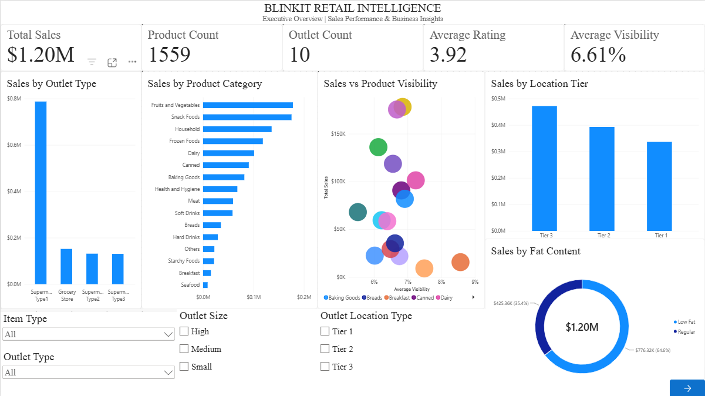
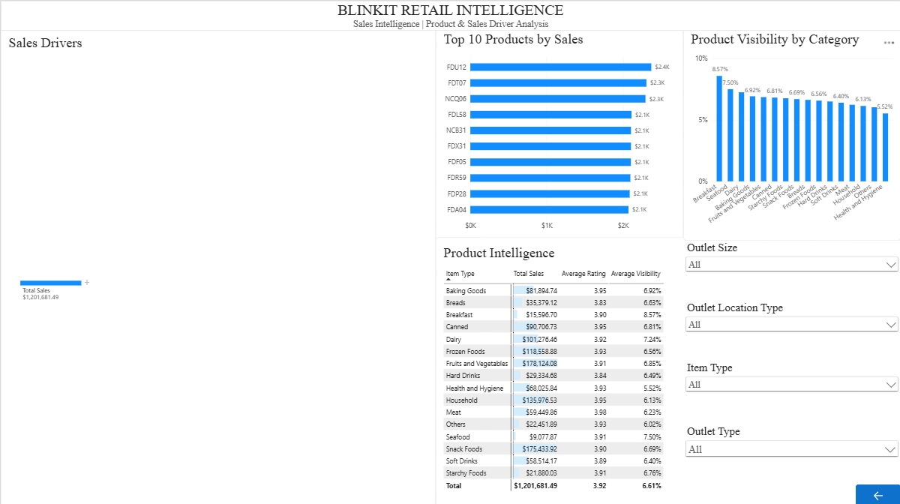

# BlinkIT Retail Intelligence — Power BI

Interactive Power BI dashboard for analyzing retail sales performance, product intelligence, outlet performance, and sales drivers.

## 📊 Dashboard Preview

### Executive Overview


### Sales Intelligence


---

## 🎯 Business Problem

Retail businesses generate large volumes of transactional data across products, outlets, locations, and store formats. Without a structured analytical view, it can be difficult to understand:

- Which outlet types contribute the most sales
- Which product categories drive revenue
- How sales vary across location tiers
- Which products are the strongest contributors
- How product visibility differs across categories
- Which business dimensions can be explored to understand sales performance

This project converts the raw BlinkIT grocery dataset into an interactive business intelligence dashboard using Microsoft Power BI.

## 🚀 Project Objectives

- Analyze overall retail sales performance
- Compare sales across outlet types and location tiers
- Identify high-performing product categories
- Analyze product-level sales contribution
- Explore relationships between product visibility and sales
- Provide interactive sales-driver analysis using a Decomposition Tree
- Build a clean, executive-friendly two-page Power BI dashboard

## 📁 Dataset

The dataset contains **8,523 records**, covering **1,559 unique products across 10 outlets**.

Key fields include:

- Item Fat Content
- Item Identifier
- Item Type
- Outlet Establishment Year
- Outlet Identifier
- Outlet Location Type
- Outlet Size
- Outlet Type
- Item Visibility
- Item Weight
- Sales
- Rating

## 🧹 Data Preparation

Data preparation was performed using **Power Query**.

Key transformations included:

- Standardizing inconsistent Item Fat Content values
- Validating data types
- Handling missing Item Weight values without unnecessarily removing records
- Checking duplicate records
- Validating sales, visibility, and rating ranges
- Creating an Outlet Age Group classification
- Structuring the main dataset as `Fact_Retail`
- Separating analytical measures into a dedicated `_Measures` table

## 🧠 Data Modeling & DAX

The project uses a structured Power BI model with the primary analytical table `Fact_Retail`.

Key DAX measures include:

```DAX
Total Sales =
SUM(Fact_Retail[Sales])
```

```DAX
Product Count =
DISTINCTCOUNT(Fact_Retail[Item Identifier])
```

```DAX
Outlet Count =
DISTINCTCOUNT(Fact_Retail[Outlet Identifier])
```

```DAX
Average Rating =
AVERAGE(Fact_Retail[Rating])
```

```DAX
Average Visibility =
AVERAGE(Fact_Retail[Item Visibility])
```

Additional measures were created for sales contribution, sales per outlet, and sales per product.

# 📄 Dashboard Architecture

## Page 1 — Executive Overview

Provides a high-level view of business performance.

### KPI Cards

- Total Sales
- Product Count
- Outlet Count
- Average Rating
- Average Visibility

### Visual Analysis

- Sales by Outlet Type
- Sales by Product Category
- Sales by Location Tier
- Product Visibility vs Sales
- Sales by Fat Content

### Interactive Filters

- Outlet Type
- Outlet Location Type
- Outlet Size
- Item Type

## Page 2 — Sales Intelligence

Focuses on deeper product and sales-driver analysis.

### Visual Analysis

- **Sales Drivers** — interactive Decomposition Tree
- **Top 10 Products by Sales**
- **Product Intelligence** — category-level sales, rating, and visibility
- **Product Visibility by Category**

The Decomposition Tree allows users to interactively break down sales across dimensions such as Outlet Type, Location Tier, Outlet Size, Outlet Age Group, Item Type, and Fat Content.

## 🔎 Key Business Insights

### Outlet Performance

Supermarket Type1 is the dominant outlet format, contributing approximately **₹778.5K**, or about **64.8% of total sales**.

### Location Performance

Tier 3 locations contribute the highest sales among the three location tiers, making them an important segment for further business investigation.

### Product Categories

**Fruits & Vegetables** and **Snack Foods** are among the strongest-performing product categories, followed by categories such as Household and Frozen Foods.

### Product Visibility

Average product visibility is approximately **6.61%**, with noticeable differences across product categories.

### Customer Rating

Average rating is approximately **3.92**, with relatively limited variation between categories.

> These observations describe patterns present in the dataset. They should not be interpreted as proof of causal relationships.

## 💡 Business Recommendations

1. **Prioritize high-performing outlet formats** — investigate the operational and assortment characteristics behind Supermarket Type1's strong contribution.
2. **Review Tier 3 performance** — analyze why Tier 3 locations generate strong sales and evaluate whether similar strategies can be applied elsewhere.
3. **Protect strong product categories** — maintain appropriate inventory and merchandising focus for high-performing categories.
4. **Investigate product visibility differences** — review categories with unusually high or low visibility to understand potential merchandising opportunities.
5. **Use driver analysis for deeper investigation** — use the Decomposition Tree to explore combinations of outlet, location, product, and store characteristics associated with higher sales.

## 🛠️ Tech Stack

- **Microsoft Power BI**
- **Power Query**
- **DAX**
- **Microsoft Excel**
- **GitHub**

## 📂 Project Structure

```text
blinkit-retail-intelligence-powerbi/
│
├── BlinkIT_Retail_Intelligence.pbix
├── README.md
│
└── screenshots/
    ├── executive-overview.png
    └── sales-intelligence.png
```

## ⭐ Project Highlights

- Two-page executive-style dashboard
- Interactive cross-page slicers
- Dedicated DAX measures table
- Power Query data transformation
- Product-level sales analysis
- Interactive Decomposition Tree
- Top 10 product analysis
- KPI-driven executive overview
- Clean, focused visual design
- Business-oriented recommendations
- No unsupported predictive or machine-learning claims

## 📌 Disclaimer

This project is intended for portfolio and analytical demonstration purposes. Business insights are based on the supplied dataset and represent descriptive analysis rather than causal or predictive conclusions.
