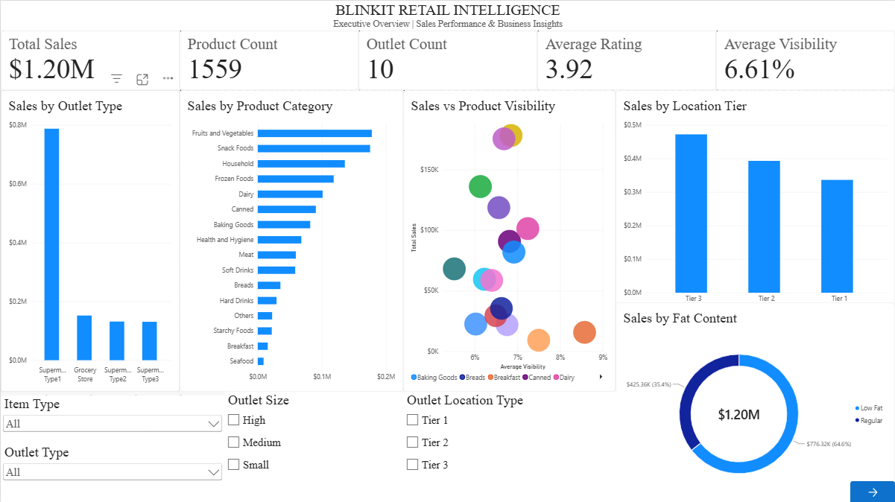
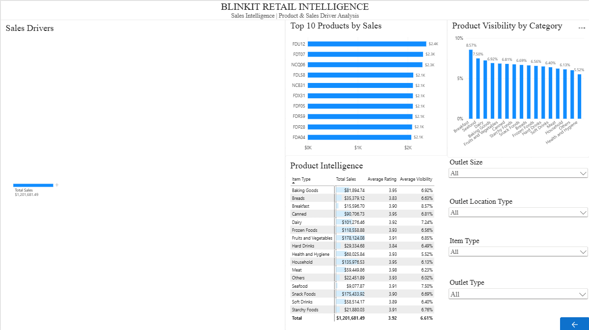
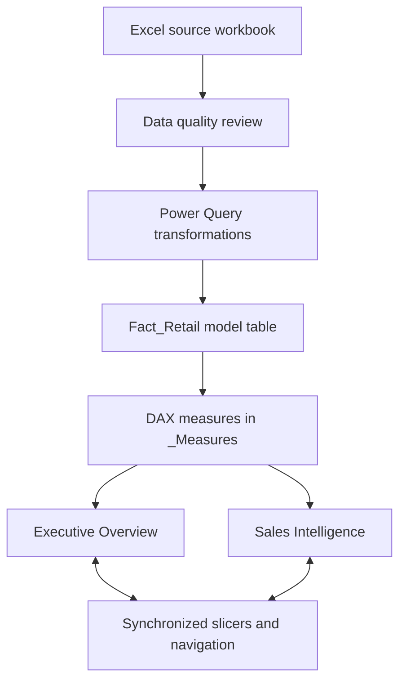

# BlinkIT Retail Intelligence Dashboard

An interactive, two-page Power BI dashboard for exploring retail sales performance across products, outlet formats, and location tiers. The project uses Power Query for data preparation and DAX measures for KPI-driven analysis.

## Table of Contents

- [1. Overview](#1-overview)
- [2. Key Features](#2-key-features)
- [3. Technology Stack](#3-technology-stack)
- [4. Getting Started](#4-getting-started)
- [5. Usage](#5-usage)
- [6. Project Structure](#6-project-structure)
- [7. Architecture and Workflow](#7-architecture-and-workflow)
- [8. Results and Evaluation](#8-results-and-evaluation)
- [9. Limitations](#9-limitations)
- [10. Future Improvements](#10-future-improvements)

---

## 1. Overview

Retail datasets contain product, outlet, and sales attributes that can be difficult to inspect efficiently in raw spreadsheet form. This project organizes the supplied BlinkIT grocery dataset into an interactive business intelligence report.

The dashboard supports high-level KPI monitoring, comparisons across outlet and product categories, product-level analysis, and interactive exploration of dimensions associated with sales.

| Dataset attribute | Count |
|---|---:|
| Records | 8,523 |
| Unique products | 1,559 |
| Outlets | 10 |
| Product categories | 16 |
| Outlet location tiers | 3 |
| Outlet types | 4 |

The source dataset includes product and outlet attributes, item visibility, sales, and ratings.

## 2. Key Features

- **Executive KPIs:** Total Sales, Product Count, Outlet Count, Average Rating, and Average Visibility.
- **Outlet analysis:** Compare sales by outlet type and location tier.
- **Category analysis:** Explore sales by product category and fat-content group.
- **Visibility analysis:** Examine item visibility alongside sales.
- **Sales driver exploration:** Interactively expand a Decomposition Tree across business dimensions.
- **Top products:** Identify the Top 10 products by sales.
- **Product intelligence:** Compare category sales, average rating, and average visibility.
- **Synchronized slicers:** Apply filters across both report pages.
- **Page navigation:** Move between Executive Overview and Sales Intelligence.

## 3. Technology Stack

| Technology | Purpose |
|---|---|
| Microsoft Power BI Desktop | Data model, visuals, and report interactivity |
| Power Query | Data cleaning and transformation |
| DAX | Measures and analytical calculations |
| Microsoft Excel | Source workbook |

## 4. Getting Started

### Requirements

- Microsoft Power BI Desktop to open and interact with the `.pbix` file.
- The report file available in this repository.
- The source Excel workbook if you need to refresh or rebuild the report.

Power BI Desktop is primarily available for Windows. On macOS, use a compatible Windows environment or Power BI Service where supported by your account and report configuration.

### Open the report

1. Clone or download this repository, or download the report and source workbook separately.
2. Open `BlinkIT_Retail_Intelligence.pbix` in Power BI Desktop.
3. If prompted for a data source, update the configured path to the source workbook available in your environment.
4. Refresh the model if required, then explore the report pages and filters.

### Refreshing the data

The report was built from the included workbook at `assets/BlinkIT Grocery Data Excel.xlsx`. Its original file path may not exist on another machine. Update the source path in **Transform data → Data source settings** or in the relevant Power Query source step to point to the included workbook before refreshing. Refresh requires local access to that file.

## 5. Usage

### Page 1 — Executive Overview

<!-- Screenshot placeholder: replace with an updated capture if the report changes. -->


Use this page to review headline KPIs and compare sales by outlet type, product category, location tier, and fat-content group. The visibility scatter plot supports exploration of visibility and sales patterns.

Available slicers:
- Outlet Type
- Outlet Location Type
- Outlet Size
- Item Type

### Page 2 — Sales Intelligence

<!-- Screenshot placeholder: replace with an updated capture if the report changes. -->


Use the **Sales Drivers** Decomposition Tree to break down sales interactively by dimensions such as outlet type, location tier, outlet size, outlet age group, item type, and fat content. The page also contains Top 10 products by sales, a Product Intelligence matrix, and product visibility by category.

Slicers are synchronized across both pages. Clear active slicer selections and visual selections to return to the default view.

## 6. Project Structure

```text
blinkit-retail-intelligence-powerbi/
├── BlinkIT_Retail_Intelligence.pbix
├── README.md
├── assets/
│   └── BlinkIT Grocery Data Excel.xlsx
└── screenshots/
    ├── executive-overview.png
    └── sales-intelligence.png
```

The screenshots are included in `screenshots/`. The repository has no separate license file, so confirm the intended licensing before redistribution.

## 7. Architecture and Workflow

<!-- Diagram placeholder: this Mermaid workflow can be replaced with an exported diagram. -->

The report follows this workflow:


```mermaid
flowchart TD
    A[Excel source workbook] --> B[Data quality review]
    B --> C[Power Query transformations]
    C --> D[Fact_Retail model table]
    D --> E[DAX measures in _Measures]
    E --> F[Executive Overview]
    E --> G[Sales Intelligence]
    F <--> H[Synchronized slicers and navigation]
    G <--> H
```

### Data preparation

Power Query was used to standardize inconsistent Item Fat Content labels, validate data types, review missing Item Weight values, and prepare the data for analysis. Missing Item Weight values were retained rather than removing otherwise usable records. An Outlet Age Group classification was also created.

### Data model and measures

The primary analytical table is named `Fact_Retail`, and a dedicated `_Measures` table organizes report measures. Core measures include Total Sales, Product Count, Outlet Count, Average Rating, and Average Visibility. Additional measures support sales contribution and per-product/per-outlet comparisons.

Example measure pattern:

```DAX
Total Sales =
SUM(Fact_Retail[Sales])
```


## 8. Results and Evaluation

### Dataset and headline metrics

| Metric | Result |
|---|---:|
| Source records | 8,523 |
| Unique products | 1,559 |
| Outlets | 10 |
| Total Sales | Approximately ₹1.20M |
| Average Visibility | Approximately 6.61% |
| Average Rating | Approximately 3.92 |

### Observed patterns

- Supermarket Type1 contributes approximately ₹778.5K, or about 64.8% of total sales in the default report context.
- Tier 3 locations have the highest sales among the three location tiers in the default context.
- Fruits & Vegetables and Snack Foods are among the highest-sales product categories.
- Average visibility differs across product categories.
- Ratings show relatively limited variation across categories.

These are descriptive observations, not evidence that outlet type, location tier, or visibility causes a particular sales outcome.

### Evaluation scope

The results above are descriptive summaries shown in the report's default filter context. No predictive model, causal analysis, or formal performance benchmark is included. Validate figures after refreshing the workbook or changing filters, since these actions can change displayed values.

## 9. Limitations

- The analysis is limited to the fields and records available in the supplied dataset.
- Missing Item Weight values remain and may limit analyses that depend on item weight.
- The report is descriptive; it does not implement causal inference, forecasting, or machine-learning predictions.
- Sales comparisons may be affected by assortment, outlet scale, location, and other factors not controlled for in the report.
- Results change when slicers or visual selections are active; reported observations refer to the default context.
- The `.pbix` file requires Power BI-compatible software for full interactivity.
- The repository does not include a license file; confirm use and redistribution terms with the repository owner.

## 10. Future Improvements

- Document a portable data-refresh process for different local file paths.
- Add time-based sales analysis if reliable transaction-date or period fields become available.
- Validate business interpretations with additional data and domain stakeholders before using them for operational decisions.
- Review accessibility, including color contrast, alt text, and keyboard-friendly navigation.
